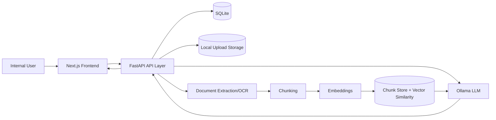
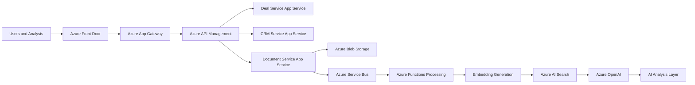
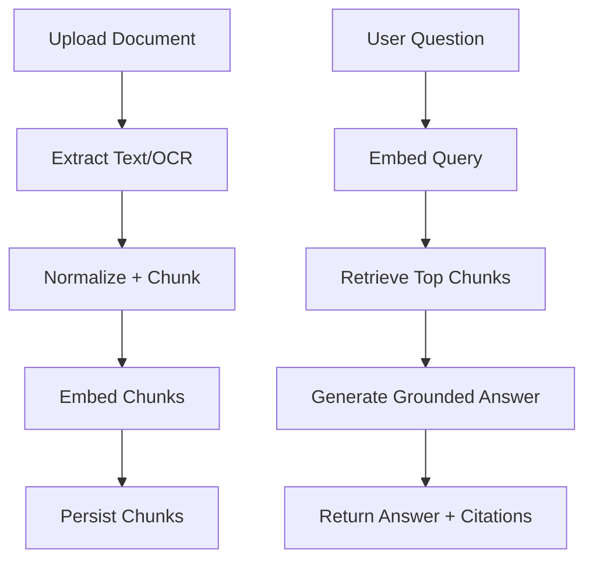
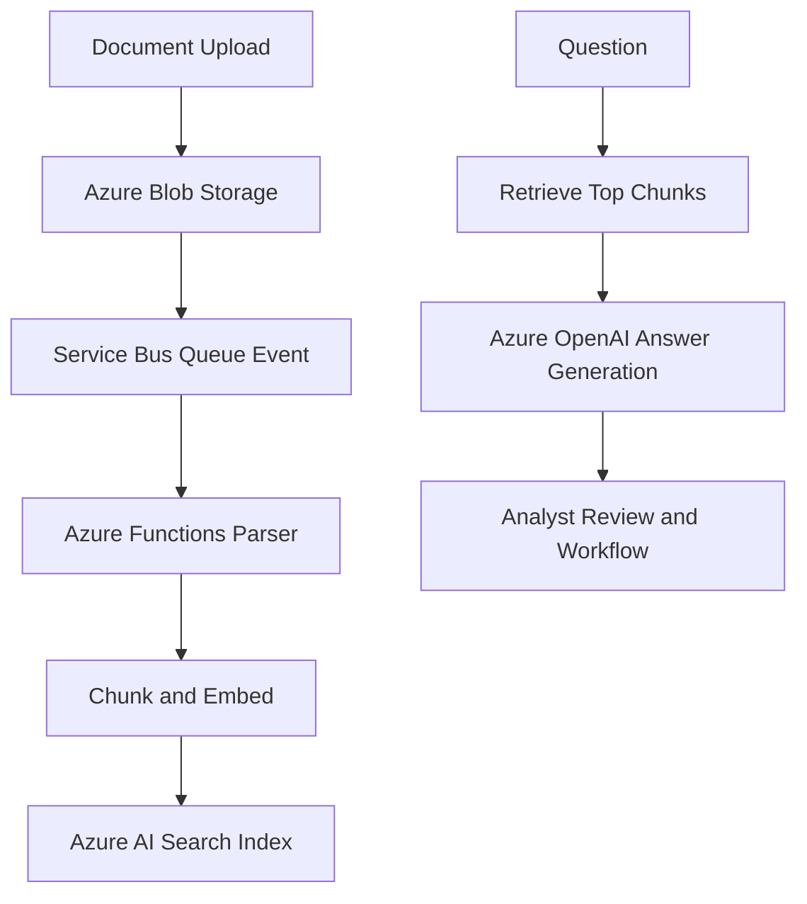

Author: Victor.I

# REOS Internal Platform

REOS is an internal real estate operating platform for deal execution, document intelligence, and AI-assisted due diligence.  
This repository includes a local-first implementation (`FastAPI + Next.js + SQLite + Ollama`) and architecture documentation for phased hardening.

## Table of Contents

- [Overview](#overview)
- [Current Capabilities](#current-capabilities)
- [Architecture](#architecture)
- [AI Pipeline](#ai-pipeline)
- [Tech Stack](#tech-stack)
- [Project Structure](#project-structure)
- [Quick Start](#quick-start)
- [Default Users](#default-users)
- [Smoke Testing](#smoke-testing)
- [Non-Stop Orchestrator](#non-stop-orchestrator)
- [Documentation](#documentation)
- [Security Notes](#security-notes)
- [Roadmap](#roadmap)
- [Azure Integration](#azure-integration)

## Overview

The platform is designed for internal teams that need one system to:

- manage deal workflow
- organize investor and broker contacts
- ingest and analyze documents
- query grounded AI outputs with citations

## Current Capabilities

- Landing, login, signup, and authenticated dashboard
- Deal and CRM contact management
- Document upload and extraction
- RAG-based AI query endpoint with citations
- Role-based user identities (`admin`, `manager`, `analyst`)
- Continuous local build/smoke orchestrator

## Architecture

Local development profile:



Azure enterprise profile:



## AI Pipeline



Azure async pipeline path:



## Tech Stack

- Frontend: Next.js (App Router)
- Backend: FastAPI + SQLAlchemy
- Database: SQLite (local)
- AI Runtime: Ollama
- OCR: Tesseract via `pytesseract`
- Test: Pytest + API smoke scripts

## Project Structure

- `frontend/` - landing, auth pages, internal dashboard UI
- `backend/` - API, auth, data models, document + AI pipeline
- `orchestrator/` - autonomous validation loop
- `scripts/` - smoke test utilities
- `samples/` - upload-ready test documents
- `docs/` - requirements, architecture, pipeline, roadmap

## Quick Start

1) Backend

```bash
cd backend
python3 -m venv .venv
source .venv/bin/activate
pip install -r requirements.txt
uvicorn app.main:app --host 0.0.0.0 --port 8000
```

2) Frontend

```bash
cd frontend
npm install
npm run dev
```

3) Open

- Frontend: `http://localhost:3000`
- Backend health: `http://localhost:8000/health`

## Default Users

- `admin / admin123`
- `analyst1 / analyst123`
- `manager1 / manager123`

You can create additional users on `/signup`.

## Smoke Testing

```bash
PYTHONPATH=. .venv/bin/python -m pytest backend/tests/test_smoke.py -q
python scripts/smoke_test.py
```

## Non-Stop Orchestrator

```bash
.venv/bin/python orchestrator/nonstop_orchestrator.py --hours 6 --sleep-seconds 20
```

## Documentation

- `docs/requirement.md`
- `docs/system-architecture.md`
- `docs/ai-due-diligence-pipeline.md`
- `docs/risk-and-tradeoffs.md`
- `docs/implementation-roadmap.md`
- `docs/interview-preparation-guide.md`
- `docs/azure-integration-and-automation.md`

## Deployment Scaffolding

- `.github/workflows/ci.yml` - backend test and frontend build validation workflow.
- `.github/workflows/azure-deploy-skeleton.yml` - staged Azure deployment placeholder pipeline.
- `infra/azure/main.bicep` - starter Azure IaC template for App Service, Blob, and Service Bus.
- `infra/azure/README.md` - deployment assumptions, required secrets, and rollout caveats.

## Azure Integration

The backend now includes provider-ready integration points for enterprise Azure rollout:

- `REOS_AI_PROVIDER=azure_openai` to route embeddings/chat calls to Azure OpenAI deployments
- `/integrations/status` endpoint to verify Azure OpenAI, Blob, Entra ID, and Key Vault readiness
- `/architecture/azure` endpoint to expose a canonical Azure architecture map for UI and docs consistency
- `/integrations/mode` endpoint to switch runtime posture between local and Azure modes (config-level only)
- `/automation/recommendations` endpoint to prioritize workflow automation with risk-aware guidance

Additional Azure integration environment variables:

- `REOS_RUNTIME_MODE` (`local` or `azure`)
- `REOS_AZURE_FRONT_DOOR_HOST`
- `REOS_AZURE_APP_GATEWAY_HOST`
- `REOS_AZURE_APIM_NAME`
- `REOS_AZURE_SERVICE_BUS_NAMESPACE`
- `REOS_AZURE_SERVICE_BUS_QUEUE`
- `REOS_AZURE_AI_SEARCH_ENDPOINT`
- `REOS_AZURE_AI_SEARCH_INDEX`
- `REOS_AZURE_FUNCTIONS_APP`

## Security Notes

- For local development only; do not use default credentials in shared environments.
- Move to managed secret storage and stronger auth/session controls before production use.
- Restrict CORS origins and enforce tenant isolation in production topology.

## Roadmap

- Add pagination and filtering across dashboard entities
- Introduce stronger auth/session lifecycle and permission boundaries
- Add persistent vector index and richer analytics observability
- Harden deployment profile for production operations
