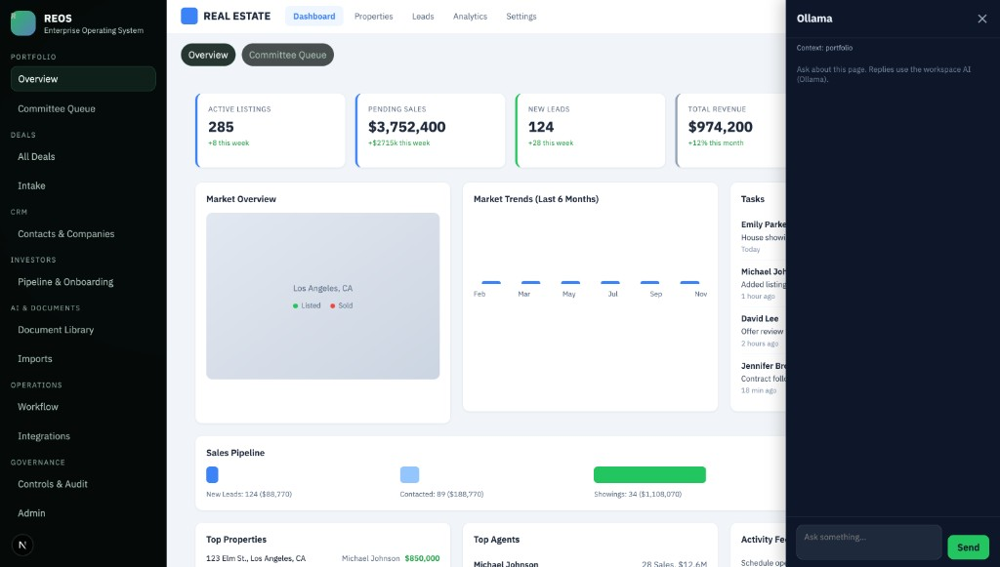
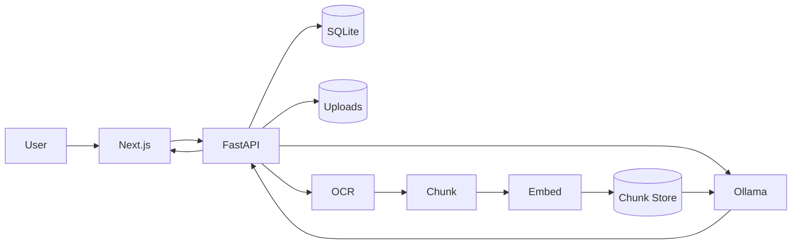
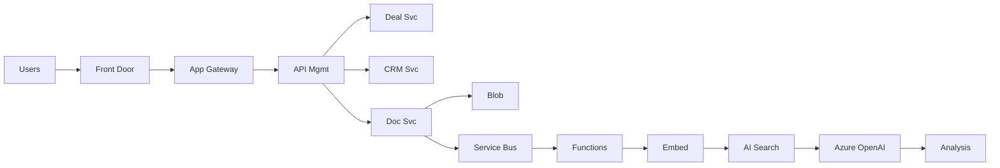
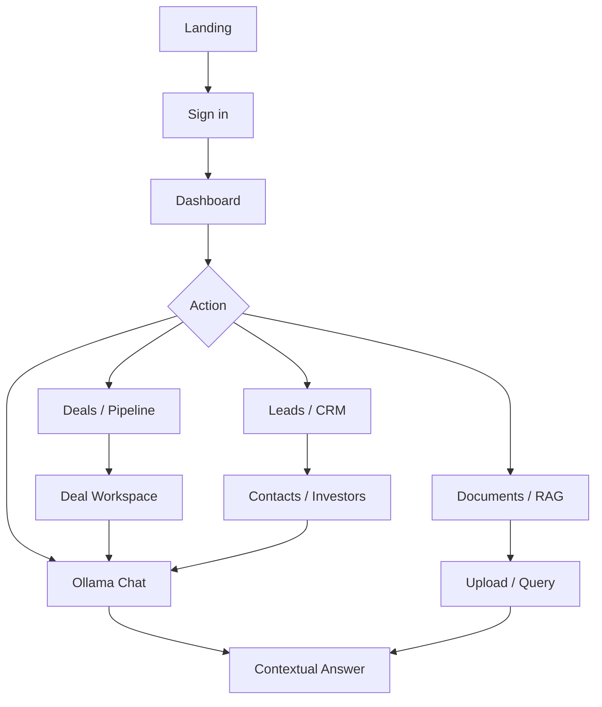
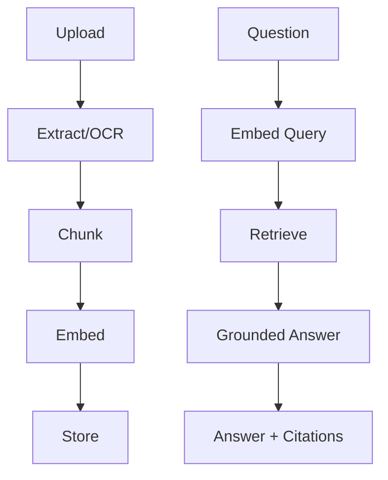
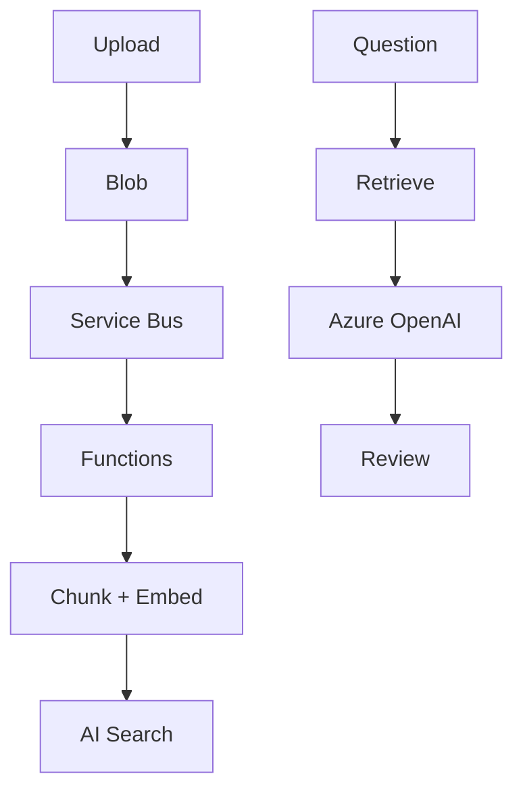

# REOS – Real Estate Operating System

**Author:** Victor.I

Internal real estate operating platform for deal execution, document intelligence, and AI-assisted due diligence. Local-first stack: FastAPI, Next.js, SQLite, Ollama.



---

## Table of Contents

- [Business Value](#business-value)
- [Overview](#overview)
- [Features](#features)
- [Architecture](#architecture)
- [User & Data Flow](#user--data-flow)
- [AI Pipeline](#ai-pipeline)
- [Tech Stack](#tech-stack)
- [Project Structure](#project-structure)
- [Quick Start](#quick-start)
- [Default Users](#default-users)
- [Testing](#testing)
- [Documentation](#documentation)
- [Deployment](#deployment)
- [Azure Integration](#azure-integration)
- [Security](#security)
- [Roadmap](#roadmap)

---

## Business Value

| Problem | How REOS Helps |
|--------|-----------------|
| Fragmented deal tracking | Single workspace: pipeline, committee queue, diligence, and watchlists in one place |
| Document silos and manual review | Ingest, extract, chunk, and query documents with RAG and citations |
| Ad hoc investor spreadsheets | CRM, pipeline, onboarding, and relationship memory in one system |
| No traceability for decisions | Audit events, AI run history, integration posture, and controls in one control plane |
| Slow operator workflows | Task-oriented AI (Ollama) and contextual chat on every page |

**Outcomes:** Decision compression for acquisitions, diligence, investor growth, and governance; one operating layer that scales from local use to Azure-backed enterprise.

---

## Overview

REOS gives internal teams one system to:

- **Manage deal workflow** from intake to committee and closing
- **Organize investor and broker contacts** with pipeline and onboarding
- **Ingest and analyze documents** with extraction and RAG
- **Query grounded AI** with answers and citations

---

## Features

- **Landing, login, and authenticated dashboard** – KPIs, pipeline, **decision-velocity proxy** (intake to IC pressure), **six core workflow cards** (deals, CRM, docs, investors, reports), tasks, activity
- **Deal and CRM** – Deals hub, **stage control on deal workspace**, contacts, companies, investor email import
- **Document intelligence** – Upload, extraction, and RAG-based query with citations
- **Ollama AI** – Contextual chat panel on every page; workspace-aware copilot
- **Role-based access** – `admin`, `manager`, `analyst` with governance and admin surfaces
- **Local and Azure-ready** – SQLite + Ollama locally; optional Azure OpenAI, Blob, Service Bus, AI Search

---

## Architecture

### Local development



### Azure enterprise



---

## User & Data Flow



---

## AI Pipeline

**Local (Ollama):**



**Azure async:**



---

## Tech Stack

| Layer | Technology |
|-------|------------|
| Frontend | Next.js (App Router), React |
| Backend | FastAPI, SQLAlchemy |
| Database | SQLite (local) |
| AI | Ollama (local), optional Azure OpenAI |
| OCR | Tesseract via `pytesseract` |
| Tests | Pytest, smoke scripts |

---

## Project Structure

```
.
├── frontend/          # Next.js app (landing, auth, dashboard, Ollama chat)
├── backend/           # FastAPI API, auth, models, document + AI pipeline
├── orchestrator/      # Validation loop
├── scripts/           # Smoke test utilities
├── samples/           # Sample documents
├── docs/              # Requirements, architecture, roadmap
│   └── screenshots/   # UI screenshots
└── infra/azure/       # Bicep and deployment notes
```

---

## Product demo vs production connectors

For roughly full UI and API depth **without** Microsoft, DocuSign, data vendors, or other externals: run SQLite + local auth, enable `REOS_PRODUCT_DEMO_MODE=true` so the integrations control plane is labeled as demo-only, and use **Load demonstration data** on Overview (admin/manager) or `POST /demo/seed`. Optional `REOS_ALLOW_LOCAL_SIGNUP=true` adds analyst self-provision for sandboxes. Production still expects Entra (or controlled provisioning) and real connector credentials.

## Quick Start

**1. Backend**

```bash
cd backend
python3 -m venv .venv
source .venv/bin/activate
pip install -r requirements.txt
# Optional: copy backend/.env.example to .env and set:
# REOS_ENABLE_LOCAL_BOOTSTRAP=true REOS_LOCAL_LOGIN_ENABLED=true REOS_SESSION_SECRET=your-secret
uvicorn app.main:app --host 0.0.0.0 --port 8000
```

**2. Frontend**

```bash
cd frontend
npm install
npm run dev
```

**3. Open**

- **App:** [http://localhost:30001](http://localhost:30001)
- **API health:** [http://localhost:8000/health](http://localhost:8000/health)

---

## Default Users

| Username | Password | Role |
|----------|----------|------|
| admin | admin123 | admin |
| analyst1 | analyst123 | analyst |
| manager1 | manager123 | manager |

Default users exist only when the backend is run with `REOS_ENABLE_LOCAL_BOOTSTRAP=true` and `REOS_LOCAL_LOGIN_ENABLED=true` (see `backend/.env.example`).

---

## Testing

```bash
# Backend tests
PYTHONPATH=. .venv/bin/python -m pytest backend/tests/test_smoke.py -q

# Minimal smoke (deal + contact; optional AI if RUN_AI_SMOKE=1)
python scripts/smoke_test.py

# Full read-path smoke (seeds demo data, hits dashboard + overviews + governance)
# Requires API running with REOS_ENABLE_LOCAL_BOOTSTRAP=true REOS_LOCAL_LOGIN_ENABLED=true
export REOS_ENABLE_LOCAL_BOOTSTRAP=true REOS_LOCAL_LOGIN_ENABLED=true
uvicorn backend.app.main:app --host 127.0.0.1 --port 8000
# other terminal:
python scripts/smoke_reos_full.py
# Optional: RUN_COPILOT=1 RUN_AI_HEAVY=1 with Ollama or REOS_AI_MODE=local_fallback
```

See `docs/AI_STRATEGY_AND_GUARDRAILS.md` for Ollama vs local_fallback, guardrails, and what stays placeholder without vendor APIs.

**Non-stop orchestrator:**

```bash
.venv/bin/python orchestrator/nonstop_orchestrator.py --hours 6 --sleep-seconds 20
```

---

## Documentation

- [Requirements](docs/requirement.md)
- [System architecture](docs/system-architecture.md)
- [AI due diligence pipeline](docs/ai-due-diligence-pipeline.md)
- [Risk and tradeoffs](docs/risk-and-tradeoffs.md)
- [Implementation roadmap](docs/implementation-roadmap.md)
- [Interview preparation](docs/interview-preparation-guide.md)
- [Azure integration](docs/azure-integration-and-automation.md)
- [AI strategy and guardrails](docs/AI_STRATEGY_AND_GUARDRAILS.md)
- [Data seed](docs/DATA_SEED.md)
- [Core operating workflows and OS KPI](docs/operating-core-workflows.md)

---

## Deployment

- **CI:** `.github/workflows/ci.yml` – backend tests and frontend build
- **Azure skeleton:** `.github/workflows/azure-deploy-skeleton.yml`
- **IaC:** `infra/azure/main.bicep` – App Service, Blob, Service Bus
- **Deploy notes:** `infra/azure/README.md`

---

## Azure Integration

- `REOS_AI_PROVIDER=azure_openai` for Azure OpenAI embeddings/chat
- `/integrations/status` – Azure OpenAI, Blob, Entra ID, Key Vault
- `/architecture/azure` – architecture map for UI/docs
- `/integrations/mode` – local vs Azure runtime
- `/automation/recommendations` – workflow automation guidance

**Env vars (examples):** `REOS_RUNTIME_MODE`, `REOS_AZURE_FRONT_DOOR_HOST`, `REOS_AZURE_APP_GATEWAY_HOST`, `REOS_AZURE_APIM_NAME`, `REOS_AZURE_SERVICE_BUS_*`, `REOS_AZURE_AI_SEARCH_*`, `REOS_AZURE_FUNCTIONS_APP`.

---

## Security

- Default credentials are for **local development only**; do not use in shared or production environments.
- Use managed secrets and stronger auth/session controls before production.
- Restrict CORS and enforce tenant isolation in production.

---

## Roadmap

- Pagination and filtering across dashboard entities
- Stronger auth/session lifecycle and permission boundaries
- Persistent vector index and richer analytics
- Production-hardened deployment profile
