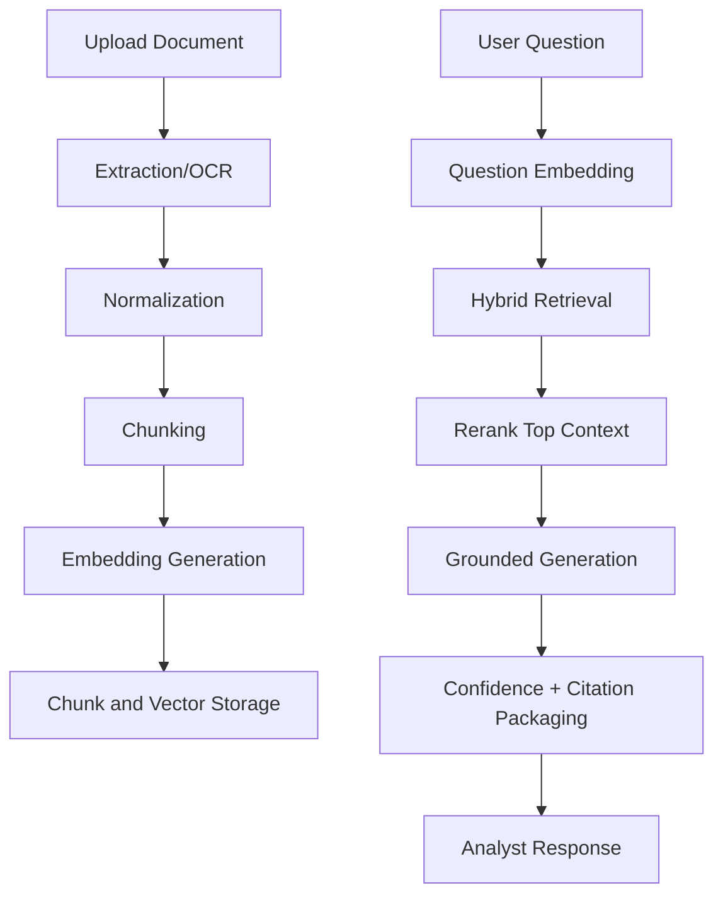

Author: Victor.I

# AI Due Diligence Pipeline

## Table of Contents

- [Pipeline Stages](#pipeline-stages)
- [Pipeline Flowchart](#pipeline-flowchart)
- [Retrieval and Grounding Rules](#retrieval-and-grounding-rules)
- [Anti-Hallucination Controls](#anti-hallucination-controls)
- [Evaluation Plan](#evaluation-plan)
- [Fallback Paths](#fallback-paths)
- [Governance and Audit](#governance-and-audit)

## Pipeline Stages

1. Capture: secure upload and source registration
2. Extraction: OCR/parse with confidence scoring
3. Normalization: entities, dates, currency, and schema validation
4. Chunking: structural-first chunking with overlap policy
5. Embeddings: versioned embedding generation and index write
6. Retrieval: hybrid lexical + dense retrieval with metadata filters
7. Reranking: precision refinement for evidence quality
8. Generation: constrained response with citations and confidence
9. Review: human approval gate for high-risk outputs

## Pipeline Flowchart

## Retrieval and Grounding Rules

- generate only from retrieved evidence
- attach citation metadata for each major claim
- return "insufficient evidence" when support is weak
- track model, prompt, and retrieval versions per response

## Anti-Hallucination Controls

- claim-to-evidence verification pass before output finalization
- policy prompt prohibiting unsupported certainty language
- escalation path when confidence is below threshold or docs conflict

## Evaluation Plan

Quality:

- Recall@K, MRR, groundedness score, unsupported-claim rate

Performance:

- p50/p95 response latency, retrieval latency budget, queue completion SLA

Cost:

- token cost per query, ingestion cost per document, monthly AI spend by tenant

## Fallback Paths

- vector outage -> keyword index fallback + low-confidence warning
- LLM provider outage -> secondary provider/model adapter
- reranker outage -> retrieval-only mode with stricter thresholds
- timeout -> partial evidence summary instead of hard failure

## Governance and Audit

- immutable run ledger: input docs, chunks, prompts, model versions, outputs
- analyst override and approval logs for compliance traceability
- periodic replay testing for model upgrades and regression detection

