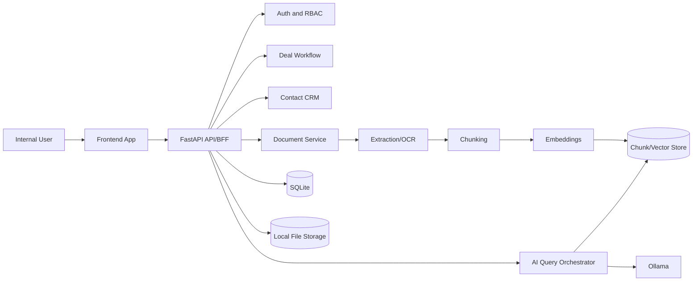

Author: Victor.I

# System Architecture

## Table of Contents

- [Context](#context)
- [High-Level Topology](#high-level-topology)
- [System Flowchart](#system-flowchart)
- [Service Boundaries](#service-boundaries)
- [Data Ownership](#data-ownership)
- [Key Read/Write Paths](#key-readwrite-paths)
- [Operational Characteristics](#operational-characteristics)
- [Observability Baseline](#observability-baseline)

## Context

This architecture is optimized for an internal operating platform with a local-first runtime and a clear path to production hardening.

## High-Level Topology

- Frontend: Next.js application for deal operations, CRM, and AI workflows
- API/BFF: FastAPI gateway for auth, aggregation, and policy enforcement
- Core services: deal workflow, CRM, documents, AI analysis, notifications
- Data plane (current local profile): SQLite + local file storage
- Async processing (current profile): synchronous orchestration in API, with orchestrator-driven validation

## System Flowchart

## Service Boundaries

- Identity and Access: users, sessions, RBAC, tenant membership
- Deal Workflow: stages, checklists, tasks, approvals, activity timeline
- CRM: investors, brokers, interactions, contact linkage
- Document Intelligence: upload, parsing, extraction, metadata, versioning
- AI Due Diligence: retrieval orchestration, analysis runs, findings, evidence map
- Integrations: external connectors, webhook ingestion, reconciliation jobs

## Data Ownership

- SQLite owns transactional truth (deals, permissions, states, audit logs)
- Local file storage owns raw and versioned document binaries
- Chunk store owns semantic retrieval state, keyed by canonical document/chunk IDs
- In-memory runtime owns ephemeral token/session state

## Key Read/Write Paths

1. User creates or updates a deal via API -> PostgreSQL.
2. User uploads document -> object storage -> async parser workflow.
3. Parser emits normalized text/chunks -> embeddings -> vector index.
4. Analyst query triggers retrieval + reranking -> grounded LLM response with citations.
5. Decision artifacts and approvals persist in PostgreSQL with immutable audit events.

## Operational Characteristics

- Horizontal scaling: stateless API and workers scale independently
- Backpressure controls: queue partitioning by job criticality
- Failure isolation: async job failures do not block core deal management flows
- Recovery: retry policy, dead-letter queue, replay tooling

## Observability Baseline

- Structured logs with correlation IDs
- Request traces across API, DB, and async workers
- SLIs: error rate, latency, queue lag, ingestion completion time
- SLO alerts tied to on-call runbooks

